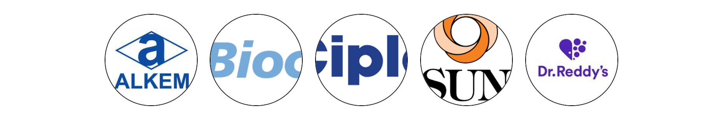

 

# INTRODUCTION
>Clinic is a project which help us to interact with some of the most experienced doctors of ENT.

* ### Simple to use
   _It is very simple to use and get familiar with features of our clinic._
* ### Reachable
  _You can simply reach us by just giving your contact details and we will reach you as soon as possible_

## How this project built
****
  This project is made up using nextJs  where we connect it with the 'mysql' database through api and insert the patients detail in the database for the future use

We also use 'antd' because it  aims to avoid complicated, messy designs and focuses on ensuring user certainty with consistent appearances.

## Features
* It give us details about most experienced doctors with   their speciality and skills
* It  provide an appointment section where you can book appointments with the doctors of your choice
* It  provide contact section where you enter your contact details and we will reach you
* It  has gallery section where you can see our clinic and equipments 
* It  has a review section where you can give review to our services

## Contributing
 
 We've released Clinic website because it helps number of people who are not able to find experienced doctors for the treatment as well as they can find which doctor they should approach according to their problems.

## Social Sites

 #### We are socially active you can reach out to us with social sites too.
 * Facebook
 * Instagram
 * Twitter
 * Telegram
 * Whats app

 ## Partners

* Alkem
* Biocon
* Cipla
* Sun Pharma
* De. Reddy's

****


This is a [Next.js](https://nextjs.org/) project bootstrapped with [`create-next-app`](https://github.com/vercel/next.js/tree/canary/packages/create-next-app).

## Getting Started

First, run the development server:


```bash
npm run dev
# or
yarn dev
# or
pnpm dev
```

Open [http://localhost:3000](http://localhost:3000) with your browser to see the result.

You can start editing the page by modifying `pages/index.js`. The page auto-updates as you edit the file.

[API routes](https://nextjs.org/docs/api-routes/introduction) can be accessed on [http://localhost:3000/api/hello](http://localhost:3000/api/hello). This endpoint can be edited in `pages/api/hello.js`.

The `pages/api` directory is mapped to `/api/*`. Files in this directory are treated as [API routes](https://nextjs.org/docs/api-routes/introduction) instead of React pages.

This project uses [`next/font`](https://nextjs.org/docs/basic-features/font-optimization) to automatically optimize and load Inter, a custom Google Font.

## Learn More

To learn more about Next.js, take a look at the following resources:

- [Next.js Documentation](https://nextjs.org/docs) - learn about Next.js features and API.
- [Learn Next.js](https://nextjs.org/learn) - an interactive Next.js tutorial.

You can check out [the Next.js GitHub repository](https://github.com/vercel/next.js/) - your feedback and contributions are welcome!

## Deploy on Vercel

The easiest way to deploy your Next.js app is to use the [Vercel Platform](https://vercel.com/new?utm_medium=default-template&filter=next.js&utm_source=create-next-app&utm_campaign=create-next-app-readme) from the creators of Next.js.

Check out our [Next.js deployment documentation](https://nextjs.org/docs/deployment) for more details.
